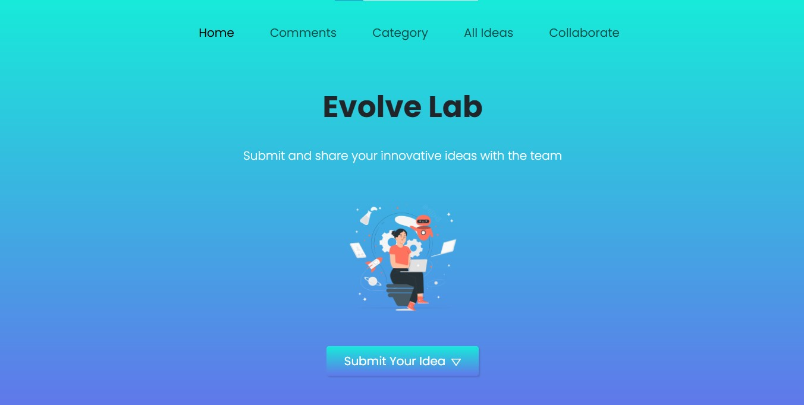
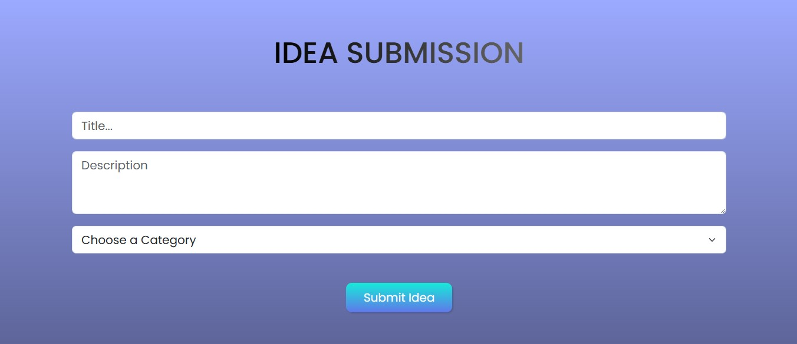
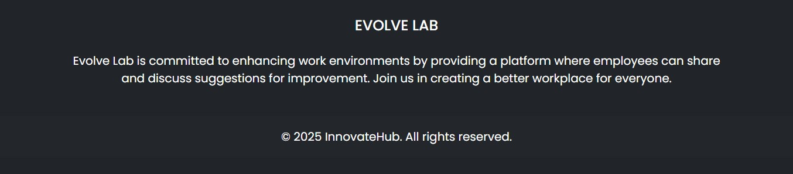

# 🚀 Evolve Lab

**Evolve Lab** is a React application that allows users to **submit, filter, and vote on innovative ideas**. It features a **responsive design**, smooth animations, and a **user-friendly interface**.  

---

## ✨ Features

🦸‍♂️ **Hero Section** – Displays the main heading and a call-to-action button to submit ideas.  
📝 **Idea Submission** – Submit new ideas with a title, description, and category.  
🔍 **Filter Ideas** – Filter submitted ideas by category and vote on them.  
💬 **Comments** – Section for users to leave feedback or discuss ideas.  
📄 **Footer** – Contains copyright and contact information.  

## 🛠️ Components

- **App** – Main component that integrates all others and manages state.  
- **Navbar** – Responsive navigation bar for desktop and mobile.  
- **IdeaSubmission** – Form for submitting new ideas with title, description, and category.  
- **FilterIdea** – Allows filtering ideas by category.  
- **Comments** – Section for reading and leaving comments.  
- **Footer** – Displays copyright and contact info.  

---

## 📦 Installation & Setup

1.  Clone the repository:

    `git clone https://github.com/saeedhalabi/Evolve-Lab.git`

2.  Navigate to the project directory:

    `cd evolve-lab`

3.  Install dependencies:

    `npm install`

4.  Start the development server:

    `npm start`

---

## 💻 Usage

1️⃣ **Submit an Idea** – Go to the Idea Submission section and fill out the form.  
2️⃣ **Filter Ideas** – Use the Filter Ideas section to browse ideas by category.  
3️⃣ **Vote on Ideas** – Click the vote button next to an idea to cast your vote.  
4️⃣ **View Comments** – Read and add comments in the Comments section.  

---

## 🤝 Contributing

If you'd like to contribute to the project, please fork the repository and create a pull request with your changes.

1.  Fork the repository.
2.  Create a new branch for your feature or bug fix:

    `git checkout -b feature-branch`

3.  Commit your changes:

    `git commit -am 'Add new feature'`

4.  Push to the branch:

    `git push origin feature-branch`

5.  Create a pull request on GitHub.

---

## 📸 Screenshots

###  🖼️ Hero Section

### 💡 Idea Submission

### 🔍 Filtering

### 📘 Footer

---

## 📬 Contact

Have questions or feedback? Let’s connect!  

📧 [Email Me](mailto:saeedrhalabi@gmail.com)  
💼 [LinkedIn](https://www.linkedin.com/in/saeed-halabi)  
🌐 [Portfolio](https://saeedhalabi.com)  

---

